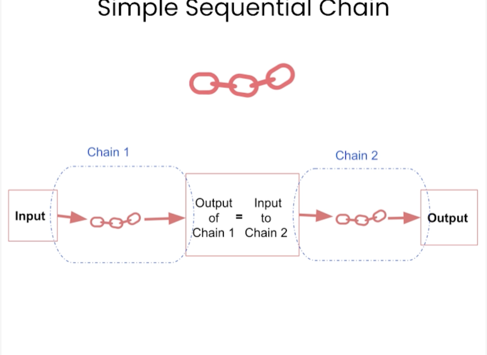
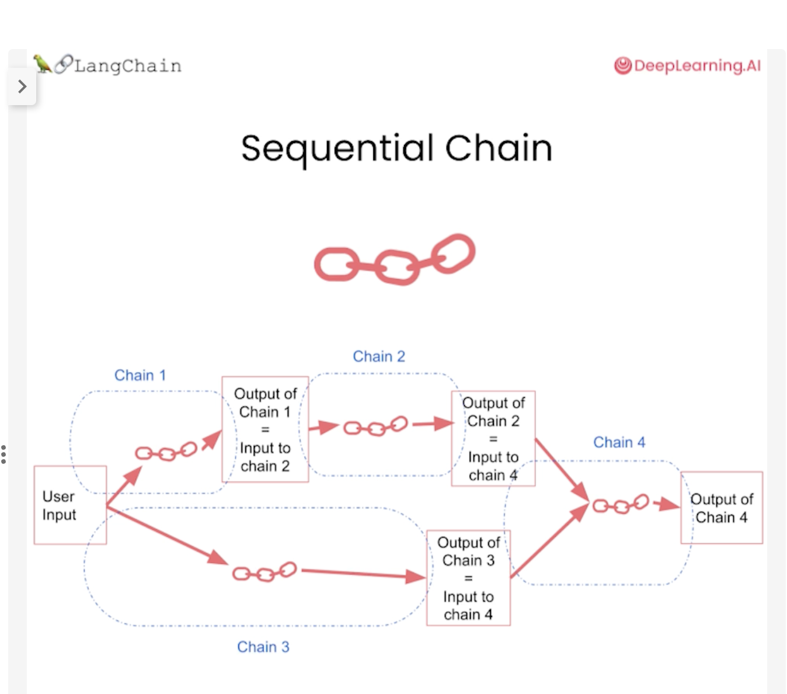

## [Official Doc](https://python.langchain.com/docs/modules/chains/)

## Chains

- I build a basic chain [here](./building_chain.py)

## Types of chains

- There are 3 main types of chains

- ### Simple sequential

  - Makes a series of calls to a language model. This is particularly useful when you want to take the output from one call and use it as the input to another.
  - 
  - [Code here](./simple_sequential.py)

- ### Sequential
  - Code here
  - 
  - Code here
- ### Router
  - Code here
