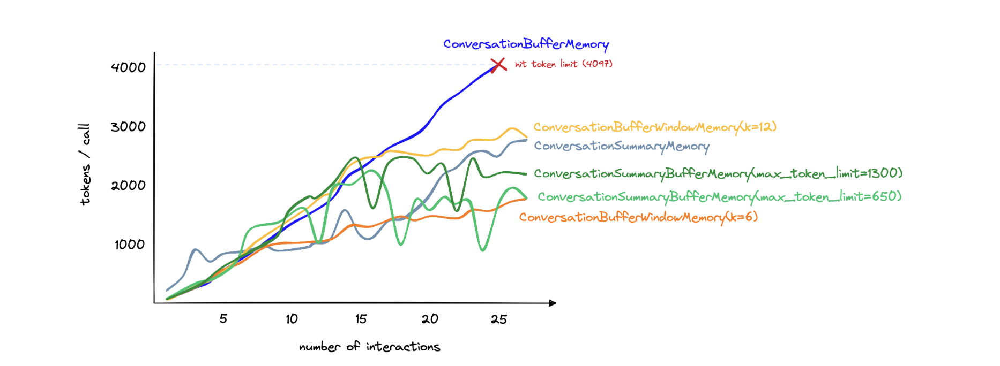

## [Great Doc](https://www.pinecone.io/learn/series/langchain/langchain-conversational-memory/)

## [Official Doc](https://python.langchain.com/docs/modules/memory/types/vectorstore_retriever_memory)

## ConversationBufferMemory

Save all the answers and send it as history in next prompt

- We save _**EVERY**_ token on our memory, or db. Send it to prompts
- [Code is here](./conversation_buffer.py)
- #### Pros
  - Storing everything gives the LLM the maximum amount of information
  - Storing everything is simple and intuitive
- #### Cons
  - More tokens mean slowing response times and higher costs
  - Long conversations cannot be remembered as we hit the LLM token limit (4096 tokens for text-davinci-003 and gpt-3.5-turbo)

### ConversationBufferWindowMemory

- To save the tokens and cost, we can define a sliding window of tokens that we want to remember
- We can define how many conversations should LLM remember
- This will be ALWAYS Last K

## ConversationSummaryMemory

### Save all the answers and send it as history in next prompt

- Why save each and every bit of token, we can summarise those token and save the summary
- We can summarize every new interaction and append it to a “running summary” of all past interactions
- [Code is here](./conversation_summary.py)
- #### Pros

  - Shortens the number of tokens for long conversations.
  - Enables much longer conversations
  - Relatively straightforward implementation, intuitively simple to understand

- #### Cons

  - Can result in higher token usage for smaller conversations
  - Memorization of the conversation history is wholly reliant on the summarization ability of the intermediate summarization LLM
  - Also requires token usage for the summarization LLM; this increases costs (but does not limit conversation length)

### Comparison

### Additional Types

1. #### Entity

- Entity memory remembers given facts about specific entities in a conversation. It extracts information on entities (using an LLM) and builds up its knowledge about that entity over time (also using an LLM).

2. #### Backed by a Vector Store

- VectorStoreRetrieverMemory stores memories in a vector store and queries the top-K most "salient" docs every time it is called.

- This differs from most of the other Memory classes in that it doesn't explicitly track the order of interactions.

- In this case, the "docs" are previous conversation snippets. This can be useful to refer to relevant pieces of information that the AI was told earlier in the conversation.
